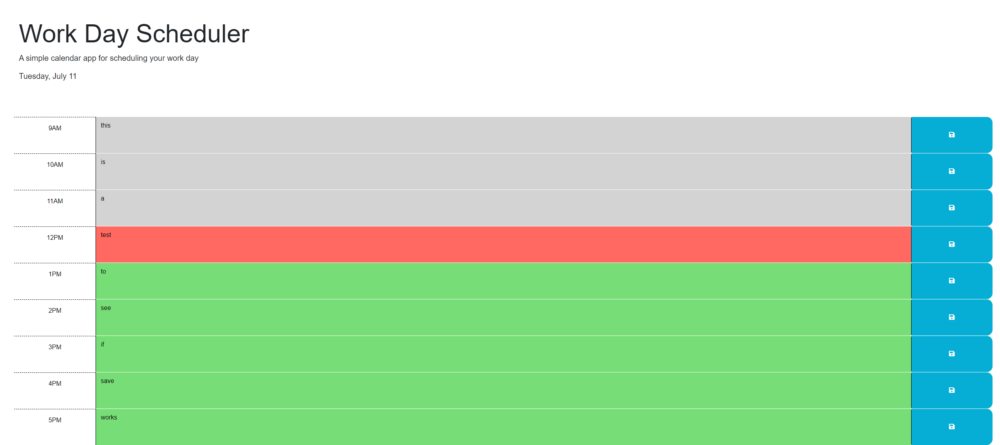

# Work Day Scheduler

## Description
Work Day scheduler is an hourly planner for your day, starting at 9am and ending at 5. The current time block will have a background of red, past blocks will be grey and future blocks will be green. You can add memos/text to the block and click the save icon which will save the information locally and will retain there even after refreshing the page.
## Screenshot

## Website
